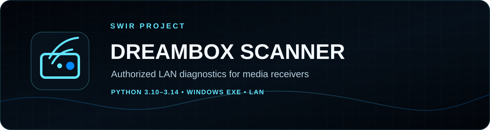
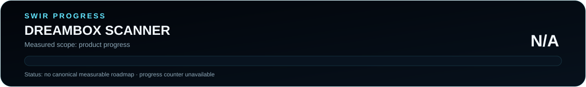

<!-- SWIR-README-STANDARD:v2 -->

<div align="center">



<br>


<br>

[](https://github.com/Swir/Dreambox-scaner/actions/workflows/ci.yml)
[](https://www.python.org/)
[](https://github.com/Swir/Dreambox-scaner/releases)


[](https://github.com/Swir)
[](https://github.com/Swir/Dreambox-scaner/releases)

[**Highlights**](#-highlights) · [**Quick Start**](#%EF%B8%8F-quick-start) · [**Security**](#-authorized-target-scope) · [**Progress**](#%EF%B8%8F-progress)

</div>


## 📍 Project Status



| Item | Status |
|---|---|
| Current stage | Stable v6.2 line |
| Packaged platform | Windows x64 |
| Source / CI | Python 3.10–3.14 |
| Latest public release | [v6.2.0](https://github.com/Swir/Dreambox-scaner/releases/tag/v6.2.0) |
| Product progress | **N/A** — no canonical measurable product roadmap |

The release version is not converted into a completion percentage. The progress graphic remains N/A until this repository has an authoritative measurable roadmap.

## 🚀 Overview

**Dreambox Scanner v6.2** is a desktop GUI and CLI diagnostic tool for media receivers on networks you own or administer. The current code keeps the modern modular v6 architecture while restoring practical workflows from earlier versions without bringing back public-Internet scanning.

It can inspect authorized private IPv4 targets for services commonly associated with Dreambox, Enigma2, OpenWebif, Vu+, Kodi, TVHeadend, NBox and HDHomeRun environments, export findings, generate local M3U files and—when explicitly requested—retrieve bounded device playlists from authorized private hosts.

## ✨ Highlights

| Feature | What it provides |
|---|---|
| 🖥️ Desktop GUI | Start/end IP workflow, port ranges, stop/cancel and result details |
| ⌨️ CLI | Scriptable authorized-LAN scans and exports |
| 🔎 Service diagnostics | Bounded probing and HTTP fingerprinting on private targets |
| 📄 Exports | JSON, CSV and classic plain-text output |
| 🎵 M3U workflow | Local generated playlists plus authorized device-playlist retrieval |
| 🧯 Safety limits | Public IP rejection, 4096-host cap and bounded worker count |
| 📦 Windows release | EXE, portable ZIP and SHA-256 assets |
| 🧪 Regression coverage | Python 3.10–3.14 CI and tests for restored workflows |

## ♻️ Why v6.2 Exists

The v6 rewrite improved architecture, safety checks, fingerprinting and release automation but removed several practical features from older versions. v6.1 restored the desktop workflow; v6.2 performs a second regression pass against the former monolithic scanner and restores additional useful behavior without restoring unsafe public-Internet scanning.

### Restored and improved

- Desktop GUI launches when the Windows EXE is run without CLI arguments.
- Start IP plus optional end IP workflow for private LAN ranges.
- TCP port ranges such as `1-1024` and mixed specifications.
- Stop button with cooperative cancellation.
- Live in-app progress bar plus host, checked-port and open-port counters.
- Double-click result details for target/service information.
- M3U generation in `HITS/`.
- `playlist_template.m3u` compatibility with classic and modern placeholders.
- JSON, CSV and plain-text result export.
- Optional HTTP credentials for devices you administer.
- Explicit authorized-LAN remote M3U retrieval with response limits, no redirects and public-IP rejection.
- Optional HTTPS preference for supported non-standard ports.

### Deliberately not restored

Earlier code included country-based random scanning of public Internet ranges and could persist credentials in plaintext configuration. Those behaviors remain intentionally excluded. v6.2 is scoped to targets you own or administer.

## ⚙️ Quick Start

### Recommended — Windows release

Download the latest verified package from [GitHub Releases](https://github.com/Swir/Dreambox-scaner/releases). The v6.2.0 release includes:

- `DreamboxScanner.exe`
- `DreamboxScanner.exe.sha256`
- `DreamboxScanner-v6.2.0-Windows-x64.zip`
- `DreamboxScanner-v6.2.0-Windows-x64.zip.sha256`

Launch `DreamboxScanner.exe` normally for the GUI, or supply CLI arguments:

```powershell
DreamboxScanner.exe 192.168.1.0/24 --authorized --ports 80,443,8001-8002,8080
```

### From source

```bash
git clone https://github.com/Swir/Dreambox-scaner.git
cd Dreambox-scaner
python -m pip install -r requirements.txt
python main.py
```

For installed entry points:

```bash
python -m pip install -e .
dreambox-scanner-gui
dreambox-scanner 192.168.1.0/24 --authorized
```

## 📋 Requirements / Compatibility

- Python **3.10–3.14** for the source package.
- Packaged public release: **Windows x64**.
- Automated CI exercises Python 3.10–3.14 on Ubuntu.
- Network access only to targets you own or administer.
- `requests`, `rich` and `urllib3` are declared runtime dependencies.

## 🖱️ GUI Workflow

1. Enter a private target/start IP.
2. Optionally enter an end IP, or use CIDR/range syntax in the first field.
3. Enter ports or ranges such as `80,443,8001-8002,8080`.
4. Adjust timeout/workers when necessary.
5. Confirm authorization for every selected target.
6. Start the scan; use **Stop** for cooperative cancellation.
7. Review details and save JSON/CSV or generated playlist output.

Very large private-LAN combinations require an additional confirmation.

## 🎵 Generated M3U Playlists

When **Generate M3U in HITS/** is enabled, hosts with discovered services can receive files such as:

```text
HITS/playlist_192_168_1_25.m3u
```

Supported template placeholders include:

```text
xxx.xxx.xxx.xxx
{{IP}}
{{OPEN_PORTS}}
{{DISCOVERED_SERVICES}}
```

The classic IP placeholder remains for compatibility with older templates.

## 📡 Authorized Remote Device Playlists

Explicit CLI retrieval is available only for discovered private/local devices you administer:

```powershell
$env:DREAMBOX_SCANNER_PASSWORD = "your-password"
dreambox-scanner 192.168.1.25 --authorized --username root --fetch-device-playlists
```

Downloaded playlists use `Device_Playlists/` by default. The compatibility path does not follow redirects, caps each response at 2 MiB and rejects public IP addresses.

## ⌨️ CLI Examples

Scan selected devices:

```bash
dreambox-scanner 192.168.1.20 192.168.1.50 --authorized
```

Scan a port range:

```bash
dreambox-scanner 192.168.1.20 --authorized --ports 1-1024
```

Export JSON:

```bash
dreambox-scanner 192.168.1.20-192.168.1.40 --authorized --ports 80,443,8001-8002 --output scan-results.json --format json
```

Use text export:

```bash
dreambox-scanner 192.168.1.20 --authorized --output scan-results.txt --format text
```

## 🛡️ Authorized Target Scope

Accepted IPv4 ranges are limited to:

- `10.0.0.0/8`
- `172.16.0.0/12`
- `192.168.0.0/16`
- `127.0.0.0/8`
- `169.254.0.0/16`

Public Internet targets are rejected. See [SECURITY.md](SECURITY.md) for safeguards and responsible-use guidance.

## 🧠 Technology / Architecture

| Layer | Technology / role |
|---|---|
| Core package | `src/dreambox_scanner/` |
| Frontends | CLI + desktop GUI |
| Networking | `requests` / `urllib3` plus bounded TCP/HTTP probing |
| Tests | `pytest` |
| Packaging | PyInstaller-based Windows release workflow |

## 🗺️ Progress


The repository publishes release history through [CHANGELOG.md](CHANGELOG.md), but it does not currently publish a canonical milestone roadmap. Product progress is therefore **N/A**, rather than being inferred from v6.2.0, test count or release assets.

Regenerate/check the documentation graphics with:

```bash
python tools/readme_progress.py --check
```

## 🧪 Development / Regression Tests

```bash
python -m pip install -e ".[dev]"
pytest
python -m compileall -q src main.py
```

The CI workflow runs this test matrix on Python 3.10–3.14.

## 📦 Releases

The latest public release is **v6.2.0**, with Windows EXE/ZIP artifacts and SHA-256 checksum files.

[**GitHub Releases →**](https://github.com/Swir/Dreambox-scaner/releases)

## 🗂️ Project Structure

```text
Dreambox-scaner/
├─ assets/
│  └─ icon.svg
├─ src/dreambox_scanner/
├─ tests/
├─ tools/
├─ main.py
├─ scanner.py
├─ pyproject.toml
└─ requirements.txt
```

## ⚠️ Limitations / Responsible Use

- Use only on networks and devices you own or administer.
- A successful open-port probe does not prove a specific receiver model.
- Remote playlist retrieval is deliberately bounded and private-address-only.
- Do not treat the tool as authorization to scan public address space.

## 🔎 Search Keywords

`dreambox scanner` • `enigma2 diagnostics` • `openwebif scanner` • `authorized lan scanner` • `dreambox windows tool` • `python network diagnostics` • `m3u playlist generator` • `private network scanner` • `vu plus diagnostics` • `tvheadend discovery` • `kodi network diagnostics` • `windows exe network tool`


<div align="center">

### `SCAN • VERIFY • DIAGNOSE • EVOLVE`

⭐ **If this project is useful, consider leaving a star.**

[**← SWIR profile**](https://github.com/Swir) · [**All projects →**](https://github.com/Swir?tab=repositories)

</div>
